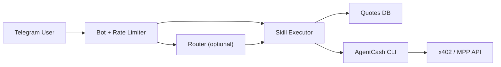

# agentcash-telegram

A quote-bound, spend-controlled Telegram surface for AgentCash. Designed to demonstrate safe payment UX and per-user wallet isolation.

**This is an MVP, not production-ready custody.** Hosted production would require a deeper custody and infrastructure review. See [docs/security.md](docs/security.md) for the honest security posture.

## What this is

AgentCash already works well in CLI, MCP, and developer tooling. This project brings it into a chat-native interface without changing the underlying payment model:

- fund a wallet once
- call paid x402/MPP endpoints from Telegram chat
- per-user isolation with explicit spend controls and immutable quote records

## Payment safety model

Every paid call goes through this sequence before execution:

1. **Quote** — AgentCash CLI is queried for a bounded cost estimate. If it cannot produce one, the call does not run.
2. **Confirmation** (if over cap) — user sees exact skill, quoted price, and expiry. An immutable `quotes` record is created.
3. **Approval** — quote is atomically marked approved (SQL `UPDATE WHERE status='pending'`). Replay attacks are rejected.
4. **Execution** — the canonical request stored in the quote record is executed, not re-parsed from user input.
5. **Audit** — quote and transaction records are updated with actual cost and response hash.

If any step fails, the call stops. Failed preflight attempts are logged in `preflight_attempts` for audit.

## Features

- per-user AgentCash wallet isolation (hashed home directories)
- `/start`, `/deposit`, `/balance`, `/history`
- `/research`, `/enrich`, `/generate`
- immutable quote records with replay protection
- spending caps with a hard MVP safety ceiling
- inline confirmation flow (quote-bound, not raw-input re-execution)
- preflight failure logging (quote failures, cap denials, replay attempts)
- per-user async locking (prevents duplicate wallet provisioning and double execution)
- transaction history scoped by hashed user ID (no PII)
- optional natural-language routing (always requires confirmation)

## Roadmap (not shipped)

- group wallets
- Discord port
- inline query mode
- hosted production deployment with distributed lock and custody review

## Setup

### 1. Clone

```bash
git clone <repo>
cd agentcash-telegram
```

### 2. Install

```bash
corepack pnpm install
```

If `better-sqlite3` has not been built yet:

```bash
corepack pnpm approve-builds
```

### 3. Create a Telegram bot token

Create a bot with BotFather and copy the token.

### 4. Configure environment variables

```bash
cp .env.example .env
openssl rand -base64 32
```

Put the generated value into `MASTER_ENCRYPTION_KEY`.

Minimum required:

- `TELEGRAM_BOT_TOKEN`
- `MASTER_ENCRYPTION_KEY`

Optional:

- `OPENAI_API_KEY` or `ANTHROPIC_API_KEY` — enables natural-language routing
- `BOT_MODE=webhook` plus webhook settings for hosted deployments
- `ALLOW_UNQUOTED_DEV_CALLS=true` — local dev only: runs calls even if AgentCash CLI cannot quote them. Marks transactions as `dev_unquoted`. **Never use in production.**

### 5. Run locally

```bash
corepack pnpm dev
```

Checks:

```bash
corepack pnpm format
corepack pnpm lint
corepack pnpm typecheck
corepack pnpm test
```

## Demo flow

1. `/start` — provisions wallet, shows deposit address
2. `/deposit` — shows funding QR code
3. `/balance` — balance and spend cap state
4. `/research latest x402 ecosystem activity` — quoted, confirmed if above cap, executed
5. `/enrich jane@example.com` — same flow
6. `/generate lobster wearing a tuxedo` — image generation with optional job polling
7. `/history` — shows last 10 transactions (sanitized, no PII)

## Architecture



- Slash commands are the primary trusted path.
- Non-slash messages route through the optional NL router, always with `forceConfirmation=true`.
- All paid calls create a quote before execution. Auto-approved if below cap, confirmation required if above.
- Confirm callbacks use `quote_id` — not re-parsed user input.

See [docs/architecture.md](docs/architecture.md) for more detail.

## Security posture

See [docs/security.md](docs/security.md) for the full, honest posture.

Key points:
- Telegram IDs are hashed (HMAC-SHA256) before storage in payment/audit tables
- Private keys are encrypted at rest (AES-256-GCM) with `MASTER_ENCRYPTION_KEY`
- No username or name fields stored in product tables
- Quote records are immutable and replay-protected at the SQL level
- AgentCash CLI dependency is a known risk: it runs as a subprocess and must be trusted
- SQLite is local-only and not suitable for distributed production
