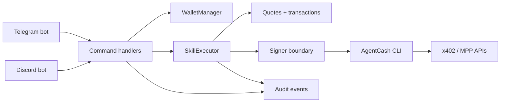

# agentcash-telegram


agentcash-telegram is a chat-native spend-control layer for AgentCash/x402 calls. It lets users and teams fund wallets, quote every paid call, enforce policies, approve risky spend, and audit usage across Telegram and Discord.

This is not "AgentCash in Telegram" and it is not a generic agent framework. Hermes already covers broad multi-channel agent gateway usage. This repo focuses on the payments UX around AgentCash/x402 calls: wallet scopes, quote ledger, policy engine, approval callbacks, audit trails, and spend analytics.

The strongest current path is Telegram private wallets. Telegram group wallets, Telegram inline previews, Discord DM wallets, and Discord guild wallets are implemented as experimental surfaces with automated tests, but they still need repeatable live smoke evidence before they should be treated as final product.

## Competitive Context

Hermes and CoWork-OS already prove that multi-channel agent surfaces are becoming table stakes. This project does not try to be a larger agent OS. It focuses on the missing payments layer: policy, approvals, and audit for AgentCash/x402 spend.

## Why This Exists

Hermes is a broad agent gateway. AgentCash as a Hermes skill proves demand for paid AgentCash/x402 actions in agent surfaces, but Hermes is not primarily a spend-governance product. agentcash-telegram is narrower: it works on the wallet scope, quote ledger, policy engine, approvals, audit export, and spend analytics needed when paid calls happen in chat.

CoWork-OS is a broad personal AI OS with wallet/x402 features. This repo is narrower and deeper for AgentCash spend governance. It does not try to replace a personal AI OS; it tries to make AgentCash/x402 spend legible, controlled, and reviewable for users and teams.

## Feature Status

| Feature | Status | Notes |
| --- | --- | --- |
| Telegram private wallet | stable MVP | `/start`, `/deposit`, `/balance`, `/cap`, `/policy`, `/spend`, `/research`, `/enrich`, `/generate`, `/history`, `/freeze`, `/unfreeze`, and `/status` are implemented and covered by automated tests around wallet provisioning, quote records, policy decisions, spend analytics, confirmations, history, freeze behavior, privacy guards, and replay rejection. Private-wallet commands are private-chat only. |
| Telegram group wallet | experimental | `/groupwallet create`, `sync-admins`, `roles`, `balance`, `deposit`, `history`, `spend`, and `cap` are implemented. Groups use `/groupwallet` only; private-wallet deposit, balance, history, and paid user-wallet commands are refused in groups with a DM instruction. Creation and admin actions require fresh Telegram creator/administrator verification. |
| Telegram inline preview | experimental | Inline results are preview-only. Paid execution requires opening the result and confirming; inline preview itself does not execute a paid call. |
| Discord DM wallet | experimental | `/ac wallet ...` and `/ac spend ...` support private balance, deposit, cap, history, research, spend review, freeze, unfreeze, and status. Details are ephemeral by default. |
| Discord guild wallet | experimental | `/ac guild ...` supports create, balance, deposit, cap, history, sync-admins, research, spend review, freeze, unfreeze, and status. Admin actions require Discord Manage Server or Administrator. |
| Slack/WhatsApp | not competing yet / roadmap | These are not implemented here. This repo is not trying to out-channel Hermes; it is focused on spend governance depth for the Telegram and Discord paths already in the codebase. |
| Production custody | not shipped | Current custody paths are local/demo-oriented or stubs. A production product needs a reviewed remote signer or KMS/HSM backend, key rotation with fund migration, external audit shipping, incident procedures, and a full security review. |

## Implementation Evidence

| Capability | Status | Evidence |
| --- | --- | --- |
| Quote-first paid execution | stable MVP | Paid calls create quote records, store canonical request data, require confirmation when policy demands it, and use SQL status transitions plus transaction idempotency keys to avoid duplicate execution. |
| Policy engine | stable MVP | `PolicyEngine` evaluates frozen-wallet state, skill allowlists, daily/weekly caps, hard caps, trusted-skill auto approval, first spend, per-call caps, and high-cost thresholds before quote execution. |
| Spend analytics | stable MVP | `/spend`, `/groupwallet spend`, and Discord spend commands expose usage by time period, skill, actor, and endpoint from existing audit data without exposing raw request content. |
| Gateway security | stable MVP | Deny-by-default allowlists, DM pairing, private-wallet command guards, bot self-message rejection, and Telegram group mention requirements run before command execution. |
| Local SQLite development | stable local path | Schema initialization, migrations, and tests run against SQLite. SQLite is not presented as production storage. |
| Postgres and Redis path | partial infrastructure | Postgres is a migration scaffold and future DB target only; the runtime adapter is not implemented. Redis lock implementation exists, but this is not claimed as production storage. |
| Health endpoints | implemented and tested | `/healthz` reports process liveness. `/readyz` checks DB, lock provider, custody/signer health, and platform config. `/metrics` exposes simple process metrics. |
| Dry-run smoke harness | implemented | `corepack pnpm smoke:dry` loads config, initializes SQLite, builds Discord command payloads, imports Telegram modules, starts the health server, and exercises quote/confirmation flow with a fake AgentCash client. |
| Release validation harness | implemented | `corepack pnpm release:check` checks required scripts, key docs, README custody wording, env coverage, branch naming, and obvious committed secret patterns. |

## Not Production Custody

This repo is **not production custody**.

The default custody mode is `local_cli`, which is demo-only. The app encrypts keys at rest, isolates key decryption inside the custody module, and avoids exposing raw private keys through the signer interface, but the local CLI path can still pass sensitive material to a trusted AgentCash subprocess. A production product needs a reviewed remote signer or KMS/HSM backend, key rotation with fund migration, external audit shipping, incident procedures, and a full security review.

See [docs/custody-review.md](docs/custody-review.md), [docs/key-rotation.md](docs/key-rotation.md), and [docs/security.md](docs/security.md).

## Architecture Diagram



More diagrams:

- [Architecture](docs/diagrams/architecture.mmd)
- [Quote flow](docs/diagrams/quote_flow.mmd)
- [Custody modes](docs/diagrams/custody_modes.mmd)
- [Telegram group wallet flow](docs/diagrams/telegram_group_wallet_flow.mmd)
- [Discord flow](docs/diagrams/discord_flow.mmd)

## Payment Safety Model

| Control | Current behavior |
| --- | --- |
| Allowlist and pairing | Gateway access is deny-by-default unless `GATEWAY_ALLOW_ALL_USERS=true`, a platform allowlist matches, or a user has an approved DM pairing code. Pairing codes are issued only in Telegram private chats or Discord DMs and are stored as hashes. |
| Private-wallet-only commands | User-wallet deposit, balance, history, and paid user-wallet commands are refused in groups with a DM instruction. Group/guild wallets use separate scoped commands. |
| Group require-mention | Telegram group free-text requires a bot mention by default. Slash commands and approval callbacks can still route without requiring free-text mention matching. |
| Policy engine | Every quote passes through `PolicyEngine`, which evaluates frozen-wallet state, skill allowlist, daily/weekly caps, hard caps, trusted-skill auto approval, first spend, per-call caps, and high-cost thresholds before execution. The policy state is snapshotted immutably in `policy_decisions` for each quote. See [docs/policy-engine.md](docs/policy-engine.md). |
| Quote ledger | Paid calls request a bounded estimate first and store the canonical execution request in the quote row. Confirmation callbacks execute the stored request, not newly parsed chat text. If AgentCash cannot quote, execution is refused unless local-only `ALLOW_UNQUOTED_DEV_CALLS=true` is set. |
| Approval callbacks | Over-cap, natural-language routed, first-spend, and forced-confirmation paths require callback approval before execution. |
| Replay rejection | Quote approval and execution use SQL status transitions so repeated button clicks cannot approve or consume the same quote twice. |
| Idempotency | Quote execution stores a deterministic upstream idempotency key derived from quote, wallet, and request hash. Execution moves through `pending`, `approved`, `executing`, `succeeded`, `execution_unknown`, `failed`, `canceled`, and `expired`. The current AgentCash CLI wrapper does not document upstream idempotency support, so automatic paid retry is disabled. |
| Caps | Per-user and group/guild per-call caps, plus `HARD_SPEND_CAP_USDC` (absolute deny). Optional daily and weekly per-wallet caps via `POLICY_DAILY_CAP_USDC` / `POLICY_WEEKLY_CAP_USDC`, with per-wallet overrides via `/policy dailycap`. Group wallets have a daily cap via `GROUP_DAILY_CAP_USDC`. |
| Freeze controls | Users can freeze their own wallet (`/policy freeze` or `/freeze`). Telegram group admins and Discord guild managers can freeze shared wallets. Frozen wallets cannot create quotes or execute paid calls; balance, deposit, and history still work. |
| Spend analytics | `/spend` (private) and `/groupwallet spend` (group admin) provide live breakdowns by time period, skill, actor, and endpoint. Derived from existing audit tables — no raw request content is exposed. Export via `/spend export` or `scripts/export-spend.ts`. See [docs/usage-insights.md](docs/usage-insights.md). |
| Audit export | Quote, transaction, admin, wallet, inline, replay, and execution events are recorded in `audit_events`. If `AUDIT_SINK=file` or `http`, an outbox worker ships sanitized copies to the configured sink and marks rows shipped. |
| Local custody caveat | The default `local_cli` custody mode is demo-only. Local encrypted keys and signer boundaries reduce accidental exposure, but production custody is not shipped. |

## Supported Platforms

| Platform | Wallet scope | Status | Admin model | Privacy defaults |
| --- | --- | --- | --- | --- |
| Telegram private chat | user wallet | stable MVP | wallet owner only | wallet details sent in private chat |
| Telegram group/supergroup | group wallet | experimental | Telegram creator/administrator plus internal owner/admin mirror | user-wallet deposit/balance/history are never posted to groups; use `/groupwallet` for group wallets |
| Telegram inline mode | user wallet confirmation entry | experimental | requester confirmation | preview-first; no paid execution from inline preview |
| Discord DM | user wallet | experimental | wallet owner only | balance/deposit/history replies are ephemeral |
| Discord guild | guild wallet | experimental | Manage Server or Administrator plus internal mirror | guild wallet balance/deposit are ephemeral unless `public=true` for deposit |
| Webhook mode | Telegram transport | implemented, not live-tested | Telegram secret token | requires HTTPS and `WEBHOOK_SECRET_TOKEN` |

## Commands

### Telegram

| Command | Scope | Status |
| --- | --- | --- |
| `/start` | private | stable MVP |
| `/help` | private/group | stable MVP |
| `/deposit` | private | stable MVP |
| `/balance` | private | stable MVP |
| `/cap [show\|off\|amount]` | private | stable MVP |
| `/research <query>` | private | stable MVP |
| `/enrich <email or company>` | private | stable MVP |
| `/generate <prompt>` | private | stable MVP |
| `/history` | private | stable MVP |
| `/freeze` | private/group | stable MVP for private, experimental for group |
| `/unfreeze` | private/group | stable MVP for private, experimental for group |
| `/status` | private/group | stable MVP for private, experimental for group |
| `/policy [show]` | private | stable MVP |
| `/policy dailycap <amount\|off>` | private | stable MVP |
| `/policy weeklycap <amount\|off>` | private | stable MVP |
| `/policy allow-skill <skill>` | private | stable MVP |
| `/policy block-skill <skill>` | private | stable MVP |
| `/spend` | private | stable MVP |
| `/spend today` | private | stable MVP |
| `/spend week` | private | stable MVP |
| `/spend skills` | private | stable MVP |
| `/spend export` | private | stable MVP |
| `/groupwallet create` | group/supergroup | experimental |
| `/groupwallet sync-admins` | group/supergroup | experimental |
| `/groupwallet roles` | group/supergroup | experimental |
| `/groupwallet balance` | group/supergroup | experimental |
| `/groupwallet deposit` | group/supergroup | experimental |
| `/groupwallet history` | group/supergroup | experimental |
| `/groupwallet cap [show\|off\|amount]` | group/supergroup | experimental |
| `/groupwallet spend` | group/supergroup | experimental |
| `/groupwallet spend users` | group/supergroup (admin) | experimental |
| `/groupwallet spend skills` | group/supergroup | experimental |
| `/groupwallet export` | group/supergroup (admin) | experimental |

### Discord

| Command | Scope | Status |
| --- | --- | --- |
| `/ac wallet balance` | DM/guild, user wallet | experimental |
| `/ac wallet deposit` | DM/guild, user wallet | experimental |
| `/ac wallet cap amount:<show\|off\|amount>` | DM/guild, user wallet | experimental |
| `/ac wallet history` | DM/guild, user wallet | experimental |
| `/ac wallet research query:<query>` | DM/guild, user wallet | experimental |
| `/ac wallet freeze` | DM/guild, user wallet | experimental |
| `/ac wallet unfreeze` | DM/guild, user wallet | experimental |
| `/ac wallet status` | DM/guild, user wallet | experimental |
| `/ac guild create` | guild only | experimental |
| `/ac guild balance` | guild only | experimental |
| `/ac guild deposit public:<boolean>` | guild only | experimental |
| `/ac guild cap amount:<show\|off\|amount>` | guild only | experimental |
| `/ac guild history` | guild only | experimental |
| `/ac guild sync-admins` | guild only | experimental |
| `/ac guild research query:<query>` | guild only | experimental |
| `/ac guild freeze` | guild only | experimental |
| `/ac guild unfreeze` | guild only | experimental |
| `/ac guild status` | guild only | experimental |
| `/ac spend today` | DM/guild, user wallet | experimental |
| `/ac spend week` | DM/guild, user wallet | experimental |
| `/ac guild spend` | guild only (admin) | experimental |

## Setup

```bash
git clone https://github.com/akumoli-debug/agentcash-telegram.git
cd agentcash-telegram
corepack pnpm install
cp .env.example .env
openssl rand -base64 32
```

Put the generated 32-byte base64 key into `MASTER_ENCRYPTION_KEY`.

If `better-sqlite3` requires native build approval:

```bash
corepack pnpm approve-builds
corepack pnpm install
```

## Local Demo

Minimum local Telegram demo:

```bash
corepack pnpm dev
```

Required environment:

- `MASTER_ENCRYPTION_KEY`
- `TELEGRAM_BOT_TOKEN` or `DISCORD_BOT_TOKEN`
- `DISCORD_APPLICATION_ID` when Discord is enabled
- AgentCash CLI available via `AGENTCASH_COMMAND` and pinned `AGENTCASH_ARGS`

The AgentCash CLI is pinned for demos and release builds so upstream CLI changes cannot alter wallet, quote, or fetch behavior overnight. This repo was last validated with `AGENTCASH_ARGS=agentcash@0.14.3`; see [docs/agentcash-cli.md](docs/agentcash-cli.md) for upgrade and rollback steps. `NODE_ENV=production` rejects floating latest dist tags.

For a no-AgentCash local dry demo only:

```bash
SKIP_AGENTCASH_HEALTHCHECK=true corepack pnpm smoke:dry
```

`NODE_ENV=production` rejects `SKIP_AGENTCASH_HEALTHCHECK=true`.

Local/demo Docker compose is explicit:

```bash
docker compose -f docker-compose.demo.yml up --build
```

The default `docker-compose.yml` is a Postgres scaffold profile only, not the app runtime.

## Live Smoke Test

Dry run:

```bash
corepack pnpm smoke:dry
```

AgentCash CLI health:

```bash
corepack pnpm smoke:agentcash
```

Manual live checklist printer:

```bash
corepack pnpm smoke:live -- --no-funds
```

The smoke harness never submits a real paid call automatically. Use `LIVE_FUNDS_TEST=true` only when intentionally performing the manual funded steps yourself.

Live Telegram steps:

1. Start the app with real `TELEGRAM_BOT_TOKEN`.
2. DM `/start`, `/deposit`, `/balance`, `/cap 0.25`, `/research latest x402 ecosystem activity`.
3. Confirm once if prompted.
4. Press the same confirm button again and verify replay rejection.
5. Run `/history`.
6. In a group, verify `/start`, `/deposit`, `/balance`, `/history`, `/research`, and natural-language text return only the DM instruction and never wallet details.
7. In a group where the bot is admin, run `/groupwallet create`, `/groupwallet sync-admins`, `/groupwallet roles`, and `/groupwallet balance`.
8. From a non-admin member, verify `/groupwallet create` and `/groupwallet cap` are refused.
9. If inline mode is enabled in BotFather, type `@<bot username> research x402` and verify no paid call executes from the preview.

Live Discord steps:

1. Install the Discord app with `bot` and `applications.commands` scopes.
2. Use `DISCORD_DEV_GUILD_ID` for instant dev guild command updates, or wait for global command propagation in production.
3. In a DM, run `/ac wallet balance`, `/ac wallet deposit`, `/ac wallet cap`, `/ac wallet research query:latest x402 ecosystem activity`, and `/ac wallet history`.
4. Confirm once if prompted and verify replay rejection.
5. In a guild, verify a non-manager cannot run `/ac guild create`.
6. As Manage Server/Admin, run `/ac guild create`, `/ac guild sync-admins`, `/ac guild balance`, `/ac guild cap`, `/ac guild research query:latest x402 ecosystem activity`, and `/ac guild history`.

Record the date, environment, commit SHA, whether funds were used, and any upstream AgentCash CLI failures.

## Tests

```bash
corepack pnpm format
corepack pnpm lint
corepack pnpm typecheck
corepack pnpm test
corepack pnpm build
corepack pnpm smoke:dry
corepack pnpm release:check
```

Optional migration check:

```bash
corepack pnpm db:migrate
```

## Security Posture

### Gateway Security Layer

Every inbound platform event passes through the gateway security policy before any command executes. The policy is a pure function with no database side effects. Default is maximally secure:

| Control | Default |
| --- | --- |
| Unknown user access | **denied** — no wallet, no command |
| Pairing mode | `disabled` — opt-in via `PAIRING_MODE=dm_code` |
| Group mention required | **true** — plain group text silently dropped unless `@Bot` mentioned |
| Private commands in groups | **blocked** — `/start`, `/deposit`, `/balance`, `/cap`, `/history`, `/research`, `/enrich`, `/generate` reply with DM instruction, never wallet data |
| Bot self-messages | **silently dropped** — prevents feedback loops |
| Pairing codes in groups | **never** — codes only issued in private/DM |

To allow users: set `TELEGRAM_ALLOWED_USERS=<comma-separated raw IDs>` (hashed at startup) or set `GATEWAY_ALLOW_ALL_USERS=true` for open bots. See [docs/gateway-security.md](docs/gateway-security.md) for the full allowlist, pairing, and group-mention reference.

### Transport and Custody

- Platform identifiers are hashed for wallet/audit surfaces where practical.
- Raw Telegram/Discord names are not stored for group/guild admin sync.
- Private keys are encrypted at rest for local demo custody.
- Raw private keys are not exposed through the signer interface.
- `local_cli` custody remains demo-only because it relies on a trusted subprocess boundary.
- Production config rejects unsafe defaults unless explicit unsafe overrides are set.
- Telegram group wallet admin actions require fresh Telegram admin verification.
- Discord guild wallet admin actions require Manage Server or Administrator.
- Logs and audit events redact prompts, raw emails, tokens, secrets, private keys, raw platform IDs, and full API responses.
- `audit_events` remains the source of truth; external file/HTTP audit shipping is handled by a best-effort outbox worker unless `AUDIT_STRICT_MODE=true` is used to fail readiness when the sink is unhealthy.
- SQLite and local locks are local/demo only.

Operational docs:

- [Gateway security](docs/gateway-security.md)
- [Policy engine](docs/policy-engine.md)
- [Deployment](docs/deployment.md)
- [Readiness](docs/readiness.md)
- [Database](docs/database.md)
- [Concurrency](docs/concurrency.md)
- [Discord](docs/discord.md)
- [Telegram group wallets](docs/group-wallets.md)
- [Security](docs/security.md)
- [Audit](docs/audit.md)
- [Execution reconciliation](docs/execution-reconciliation.md)
- [Custody review](docs/custody-review.md)
- [Key rotation](docs/key-rotation.md)

Runbooks:

- [Leaked bot token](docs/runbooks/leaked_bot_token.md)
- [Leaked master key](docs/runbooks/leaked_master_key.md)
- [Suspicious spend](docs/runbooks/suspicious_spend.md)
- [Failed AgentCash CLI](docs/runbooks/failed_agentcash_cli.md)
- [Redis outage](docs/runbooks/redis_outage.md)
- [Postgres outage](docs/runbooks/postgres_outage.md)
- [Revoke user or group](docs/runbooks/revoke_user_or_group.md)

## Roadmap

1. Implement the full Postgres runtime repository adapter and run the entire suite against Postgres.
2. Make Redis/distributed locks and DB idempotency the default production path.
3. Implement a reviewed remote signer or KMS/HSM backend.
4. Add upstream AgentCash reconciliation support and continuous execution reconciliation scheduling.
5. Harden audit shipping with alerting, retention policy, and immutable external storage.
6. Capture dated live smoke evidence for Telegram private, Telegram group, inline mode, Discord DM, Discord guild, webhook, and manual AgentCash calls.
7. Add managed secrets, backup/restore drills, and deployment monitoring.

## Why This Matters

AgentCash makes paid agent/API calls feel composable. This repo shows the missing product control plane around that idea: scoped wallets, quote ledger, policies, approvals, shared spend, audit, usage analytics, and incident controls in the chat surfaces where operators already work.

The v0.1 value is not pretending custody is solved. The value is making spend legible and controlled, proving the chat UX, and drawing a clean boundary between demo custody and the production signer/storage work that should come next.
