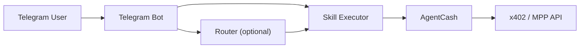

# agentcash-telegram

Telegram interface for AgentCash: fund once, call paid x402/MPP APIs from chat.

## Why this exists

AgentCash already works well in CLI, MCP, and developer tooling workflows. That is a strong starting point, but it assumes the user is at a terminal or inside an agent runtime.

Telegram is already where a lot of crypto-native coordination happens. For a Merit-style project, that makes it a practical surface for bringing AgentCash into a mobile-first, chat-native loop without changing the underlying payment model.

This repo is a contributor project that keeps the core AgentCash flow intact:

- fund a wallet once
- call paid x402/MPP endpoints from a chat interface
- keep per-user isolation and explicit spend controls

## Features

- per-user AgentCash wallet isolation
- `/start`, `/deposit`, `/balance`
- `/research`, `/enrich`, `/generate`
- spending caps with a hard MVP safety ceiling
- inline confirmation flow for paid calls
- transaction logging with hashed request and response records
- optional natural-language routing for non-slash messages

## Architecture



Notes:

- Slash commands go directly to the skill executor.
- Non-slash messages only use the router when `OPENAI_API_KEY` or `ANTHROPIC_API_KEY` is configured.
- All paid execution paths go through the same spending-cap and confirmation pipeline.

## Setup

### 1. Clone

```bash
git clone <your-fork-or-local-path>
cd agentcash-telegram
```

### 2. Install

```bash
corepack pnpm install
```

If `better-sqlite3` has not been built yet:

```bash
corepack pnpm approve-builds
```

Approve `better-sqlite3`, then continue.

### 3. Create a Telegram bot token

Create a bot with BotFather and copy the token into your environment file.

### 4. Configure environment variables

```bash
cp .env.example .env
openssl rand -base64 32
```

Put the generated value into `MASTER_ENCRYPTION_KEY` in `.env`.

Minimum required values:

- `TELEGRAM_BOT_TOKEN`
- `MASTER_ENCRYPTION_KEY`

Optional values:

- `OPENAI_API_KEY` or `ANTHROPIC_API_KEY` to enable natural-language routing
- `BOT_MODE=webhook` plus webhook settings for hosted deployments

### 5. Run locally

```bash
corepack pnpm dev
```

Useful checks:

```bash
corepack pnpm format
corepack pnpm lint
corepack pnpm typecheck
corepack pnpm test
corepack pnpm smoke:wallets
```

## Demo flow

Example local demo:

1. `/start`
2. `/deposit`
3. `/balance`
4. `/research latest x402 ecosystem activity`
5. `/enrich jane@example.com`
6. `/generate lobster wearing a tuxedo`

Expected behavior:

- `/start` provisions or loads the user wallet and returns a deposit address
- `/deposit` shows the funding QR and deposit details
- `/balance` checks current wallet balance and cap state
- paid calls run through the shared executor
- calls above the user cap require explicit confirmation

## Security model

Current security posture:

- wallets are isolated per Telegram user under hashed AgentCash home directories
- raw Telegram IDs are not used as home directory names
- wallet secret material is encrypted at rest with `MASTER_ENCRYPTION_KEY`
- paid calls flow through a single executor for balance checks, cap enforcement, confirmation, timeout handling, and transaction logging
- application logs use hashed identifiers and redact secret-bearing fields
- per-user rate limiting defaults to `30/minute` and `100/hour`
- polling mode is supported for local demos, and webhook mode supports a webhook secret token

More detail lives in [docs/security.md](/Users/annafu/Documents/Codex/2026-04-24-you-are-helping-me-build-a/agentcash-telegram/docs/security.md) and [docs/architecture.md](/Users/annafu/Documents/Codex/2026-04-24-you-are-helping-me-build-a/agentcash-telegram/docs/architecture.md).
Recon and demo notes live in [docs/recon.md](/Users/annafu/Documents/Codex/2026-04-24-you-are-helping-me-build-a/agentcash-telegram/docs/recon.md) and [docs/demo-script.md](/Users/annafu/Documents/Codex/2026-04-24-you-are-helping-me-build-a/agentcash-telegram/docs/demo-script.md).

## Roadmap

- group wallets
- Discord port
- inline query mode
- hosted deployment

## Contributing

This repo is intentionally small and boring in the right places.

The goal is not to abstract away AgentCash. The goal is to expose AgentCash safely in a Telegram-native interface with clear wallet boundaries, explicit payment confirmation, and a short path to demo.

If you contribute here, prefer:

- deterministic command flows over open-ended orchestration
- one shared paid-call pipeline over ad hoc integrations
- hashed or redacted logging over convenience debugging
- schema choices that leave room for group wallets later without implementing them now
