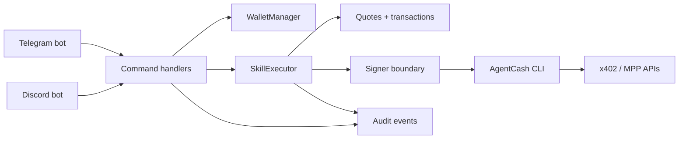

# agentcash-telegram


agentcash-telegram is a chat-native spend-control layer for paid agent/API calls.

It lets users and groups fund once, quote every paid call, enforce caps, confirm risky spend, and audit usage from chat. The strongest current path is Telegram private wallets. Group wallets, inline mode, and Discord are implemented as experimental surfaces with automated tests, but they still need repeatable live smoke evidence before they should be treated as final product.

## Demo

Demo GIF/Loom placeholder:

- GIF: `docs/assets/demo.gif`
- Loom: `TODO: add recorded v0.1 walkthrough link`

Use [docs/demo-script.md](docs/demo-script.md) for exact talk tracks and commands.

## What Works Today

| Surface | Status | Evidence |
| --- | --- | --- |
| Telegram private wallets | stable MVP | `/start`, `/deposit`, `/balance`, `/cap`, `/research`, `/enrich`, `/generate`, `/history`, `/freeze`, `/unfreeze`, and `/status` are implemented and covered by automated tests around wallet provisioning, quote records, caps, confirmations, history, freeze behavior, and replay rejection. |
| Quote-first paid execution | stable MVP | Paid calls create quote records, store canonical request data, require confirmation when needed, and use SQL status transitions plus transaction idempotency keys to avoid duplicate execution. |
| Local SQLite development | stable local path | Schema initialization, migrations, and tests run against SQLite. SQLite is not presented as production storage. |
| Health endpoints | implemented and tested | `/healthz` reports process liveness. `/readyz` checks DB, lock provider, custody/signer health, and platform config. `/metrics` exposes simple process metrics. |
| Dry-run smoke harness | implemented | `corepack pnpm smoke:dry` loads config, initializes SQLite, builds Discord command payloads, imports Telegram modules, starts the health server, and exercises quote/confirmation flow with a fake AgentCash client. |
| Release validation harness | implemented | `corepack pnpm release:check` checks required scripts, key docs, README custody wording, env coverage, branch naming, and obvious committed secret patterns. |

## Experimental Features

| Feature | Status | Notes |
| --- | --- | --- |
| Telegram group wallets | experimental, Telegram-admin-gated | `/groupwallet create`, `sync-admins`, `roles`, `balance`, `deposit`, `history`, and `cap` are implemented. Creation and admin actions require fresh Telegram creator/administrator verification. Not yet live-smoked in a real group with admin changes. |
| Telegram inline mode | experimental preview-first | Inline results are previews only; paid execution requires opening the result and confirming. Requires separate BotFather inline setup and live smoke. |
| Discord DM wallets | experimental | `/ac wallet ...` supports private balance, deposit, cap, history, research, freeze, unfreeze, and status. Details are ephemeral by default. Needs live Discord smoke. |
| Discord guild wallets | experimental | `/ac guild ...` supports create, balance, deposit, cap, history, sync-admins, research, freeze, unfreeze, and status. Admin actions require Discord Manage Server or Administrator. Needs live guild smoke and more operational review. |
| Postgres and Redis path | partial infrastructure | Migrations, adapter scaffolding, and Redis lock implementation exist. The live app still uses the SQLite repository surface, so this is not claimed as production storage yet. |
| Remote signer/KMS custody | roadmap/stub | Interfaces and stubs exist so raw key handling is isolated, but production remote signing is not shipped. |

## Not Production Custody

This repo is **not production-ready custody**.

The default custody mode is `local_cli`, which is demo-only. The app encrypts keys at rest, isolates key decryption inside the custody module, and avoids exposing raw private keys through the signer interface, but the local CLI path can still pass sensitive material to a trusted AgentCash subprocess. A production product needs a reviewed remote signer or KMS/HSM backend, key rotation with fund migration, external audit shipping, incident procedures, and a full security review.

See [docs/custody-review.md](docs/custody-review.md), [docs/key-rotation.md](docs/key-rotation.md), and [docs/security.md](docs/security.md).

## Architecture Diagram



More diagrams:

- [Architecture](docs/diagrams/architecture.mmd)
- [Quote flow](docs/diagrams/quote_flow.mmd)
- [Custody modes](docs/diagrams/custody_modes.mmd)
- [Telegram group wallet flow](docs/diagrams/telegram_group_wallet_flow.mmd)
- [Discord flow](docs/diagrams/discord_flow.mmd)

## Payment Safety Model

| Control | Current behavior |
| --- | --- |
| Quote before paid execution | Paid calls request a bounded estimate first. If AgentCash cannot quote, execution is refused unless local-only `ALLOW_UNQUOTED_DEV_CALLS=true` is set. |
| Canonical request storage | The request used for execution is stored in the quote row. Confirmation callbacks execute the stored request, not newly parsed chat text. |
| Confirmation | Over-cap, natural-language routed, and forced-confirmation paths require user confirmation before execution. |
| Replay protection | Quote approval and execution use SQL status transitions so repeated button clicks cannot approve or consume the same quote twice. |
| Idempotency | Transaction rows include unique idempotency keys, and execution moves through `pending`, `approved`, `executing`, `succeeded`, `failed`, `canceled`, and `expired`. |
| Caps | Per-user and group/guild caps exist, plus `HARD_SPEND_CAP_USDC`. Group/guild wallets also have a configured daily cap check. |
| Freeze controls | Users can freeze their own wallet. Telegram group admins and Discord guild managers can freeze shared wallets. Frozen wallets cannot create quotes or execute paid calls; balance, deposit, and history still work. |
| Audit | Quote, transaction, admin, wallet, inline, replay, and execution events are recorded with redaction rules. External audit sink wiring is still incomplete. |

## Supported Platforms

| Platform | Wallet scope | Status | Admin model | Privacy defaults |
| --- | --- | --- | --- | --- |
| Telegram private chat | user wallet | stable MVP | wallet owner only | wallet details sent in private chat |
| Telegram group/supergroup | group wallet | experimental | Telegram creator/administrator plus internal owner/admin mirror | no raw Telegram names stored; admin sync reports counts |
| Telegram inline mode | user wallet confirmation entry | experimental | requester confirmation | preview-first; no paid execution from inline preview |
| Discord DM | user wallet | experimental | wallet owner only | balance/deposit/history replies are ephemeral |
| Discord guild | guild wallet | experimental | Manage Server or Administrator plus internal mirror | guild wallet balance/deposit are ephemeral unless `public=true` for deposit |
| Webhook mode | Telegram transport | implemented, not live-tested | Telegram secret token | requires HTTPS and `WEBHOOK_SECRET_TOKEN` |

## Commands

### Telegram

| Command | Scope | Status |
| --- | --- | --- |
| `/start` | private | stable MVP |
| `/help` | private/group | stable MVP |
| `/deposit` | private | stable MVP |
| `/balance` | private | stable MVP |
| `/cap [show\|off\|amount]` | private | stable MVP |
| `/research <query>` | private/group | stable MVP for private, experimental for group wallet execution |
| `/enrich <email or company>` | private/group | stable MVP for private, experimental for group wallet execution |
| `/generate <prompt>` | private/group | stable MVP for private, experimental for group wallet execution |
| `/history` | private | stable MVP |
| `/freeze` | private/group | stable MVP for private, experimental for group |
| `/unfreeze` | private/group | stable MVP for private, experimental for group |
| `/status` | private/group | stable MVP for private, experimental for group |
| `/groupwallet create` | group/supergroup | experimental |
| `/groupwallet sync-admins` | group/supergroup | experimental |
| `/groupwallet roles` | group/supergroup | experimental |
| `/groupwallet balance` | group/supergroup | experimental |
| `/groupwallet deposit` | group/supergroup | experimental |
| `/groupwallet history` | group/supergroup | experimental |
| `/groupwallet cap [show\|off\|amount]` | group/supergroup | experimental |

### Discord

| Command | Scope | Status |
| --- | --- | --- |
| `/ac wallet balance` | DM/guild, user wallet | experimental |
| `/ac wallet deposit` | DM/guild, user wallet | experimental |
| `/ac wallet cap amount:<show\|off\|amount>` | DM/guild, user wallet | experimental |
| `/ac wallet history` | DM/guild, user wallet | experimental |
| `/ac wallet research query:<query>` | DM/guild, user wallet | experimental |
| `/ac wallet freeze` | DM/guild, user wallet | experimental |
| `/ac wallet unfreeze` | DM/guild, user wallet | experimental |
| `/ac wallet status` | DM/guild, user wallet | experimental |
| `/ac guild create` | guild only | experimental |
| `/ac guild balance` | guild only | experimental |
| `/ac guild deposit public:<boolean>` | guild only | experimental |
| `/ac guild cap amount:<show\|off\|amount>` | guild only | experimental |
| `/ac guild history` | guild only | experimental |
| `/ac guild sync-admins` | guild only | experimental |
| `/ac guild research query:<query>` | guild only | experimental |
| `/ac guild freeze` | guild only | experimental |
| `/ac guild unfreeze` | guild only | experimental |
| `/ac guild status` | guild only | experimental |

## Setup

```bash
git clone https://github.com/akumoli-debug/agentcash-telegram.git
cd agentcash-telegram
corepack pnpm install
cp .env.example .env
openssl rand -base64 32
```

Put the generated 32-byte base64 key into `MASTER_ENCRYPTION_KEY`.

If `better-sqlite3` requires native build approval:

```bash
corepack pnpm approve-builds
corepack pnpm install
```

Branch note: this checkout currently uses local branch `Main`, and both `origin/Main` and `origin/main` exist. The release branch should be canonical `main`.

```bash
git fetch origin
git branch -m Main main
git log --oneline --left-right origin/main...origin/Main
git checkout main
git merge origin/Main
git push -u origin main
git remote set-head origin main
```

Only delete the old remote branch after branch protections and deploy settings are updated:

```bash
git push origin --delete Main
```

## Local Demo

Minimum local Telegram demo:

```bash
corepack pnpm dev
```

Required environment:

- `MASTER_ENCRYPTION_KEY`
- `TELEGRAM_BOT_TOKEN` or `DISCORD_BOT_TOKEN`
- `DISCORD_APPLICATION_ID` when Discord is enabled
- AgentCash CLI available via `AGENTCASH_COMMAND` and `AGENTCASH_ARGS`

For a no-AgentCash local dry demo only:

```bash
SKIP_AGENTCASH_HEALTHCHECK=true corepack pnpm smoke:dry
```

`NODE_ENV=production` rejects `SKIP_AGENTCASH_HEALTHCHECK=true`.

## Live Smoke Test

Dry run:

```bash
corepack pnpm smoke:dry
```

AgentCash CLI health:

```bash
corepack pnpm smoke:agentcash
```

Manual live checklist printer:

```bash
corepack pnpm smoke:live -- --no-funds
```

The smoke harness never submits a real paid call automatically. Use `LIVE_FUNDS_TEST=true` only when intentionally performing the manual funded steps yourself.

Live Telegram steps:

1. Start the app with real `TELEGRAM_BOT_TOKEN`.
2. DM `/start`, `/deposit`, `/balance`, `/cap 0.25`, `/research latest x402 ecosystem activity`.
3. Confirm once if prompted.
4. Press the same confirm button again and verify replay rejection.
5. Run `/history`.
6. In a group where the bot is admin, run `/groupwallet create`, `/groupwallet sync-admins`, `/groupwallet roles`, and `/groupwallet balance`.
7. From a non-admin member, verify `/groupwallet create` and `/groupwallet cap` are refused.
8. If inline mode is enabled in BotFather, type `@<bot username> research x402` and verify no paid call executes from the preview.

Live Discord steps:

1. Install the Discord app with `bot` and `applications.commands` scopes.
2. Use `DISCORD_DEV_GUILD_ID` for instant dev guild command updates, or wait for global command propagation in production.
3. In a DM, run `/ac wallet balance`, `/ac wallet deposit`, `/ac wallet cap`, `/ac wallet research query:latest x402 ecosystem activity`, and `/ac wallet history`.
4. Confirm once if prompted and verify replay rejection.
5. In a guild, verify a non-manager cannot run `/ac guild create`.
6. As Manage Server/Admin, run `/ac guild create`, `/ac guild sync-admins`, `/ac guild balance`, `/ac guild cap`, `/ac guild research query:latest x402 ecosystem activity`, and `/ac guild history`.

Record the date, environment, commit SHA, whether funds were used, and any upstream AgentCash CLI failures.

## Tests

```bash
corepack pnpm format
corepack pnpm lint
corepack pnpm typecheck
corepack pnpm test
corepack pnpm build
corepack pnpm smoke:dry
corepack pnpm release:check
```

Optional migration check:

```bash
corepack pnpm db:migrate
```

## Security Posture

- Platform identifiers are hashed for wallet/audit surfaces where practical.
- Raw Telegram/Discord names are not stored for group/guild admin sync.
- Private keys are encrypted at rest for local demo custody.
- Raw private keys are not exposed through the signer interface.
- `local_cli` custody remains demo-only because it relies on a trusted subprocess boundary.
- Production config rejects unsafe defaults unless explicit unsafe overrides are set.
- Telegram group wallet admin actions require fresh Telegram admin verification.
- Discord guild wallet admin actions require Manage Server or Administrator.
- Logs and audit events redact prompts, raw emails, tokens, secrets, private keys, raw platform IDs, and full API responses.
- SQLite and local locks are local/demo only.

Operational docs:

- [Deployment](docs/deployment.md)
- [Readiness](docs/readiness.md)
- [Database](docs/database.md)
- [Concurrency](docs/concurrency.md)
- [Discord](docs/discord.md)
- [Telegram group wallets](docs/group-wallets.md)
- [Security](docs/security.md)
- [Custody review](docs/custody-review.md)
- [Key rotation](docs/key-rotation.md)

Runbooks:

- [Leaked bot token](docs/runbooks/leaked_bot_token.md)
- [Leaked master key](docs/runbooks/leaked_master_key.md)
- [Suspicious spend](docs/runbooks/suspicious_spend.md)
- [Failed AgentCash CLI](docs/runbooks/failed_agentcash_cli.md)
- [Redis outage](docs/runbooks/redis_outage.md)
- [Postgres outage](docs/runbooks/postgres_outage.md)
- [Revoke user or group](docs/runbooks/revoke_user_or_group.md)

## Roadmap

1. Wire the full repository layer to Postgres and run the entire suite against Postgres.
2. Make Redis/distributed locks and DB idempotency the default production path.
3. Implement a reviewed remote signer or KMS/HSM backend.
4. Add stuck `executing` quote reconciliation and execution recovery tooling.
5. Wire external audit sink shipping end to end.
6. Capture dated live smoke evidence for Telegram private, Telegram group, inline mode, Discord DM, Discord guild, webhook, and funded AgentCash calls.
7. Add managed secrets, backup/restore drills, and deployment monitoring.

## Why This Matters For AgentCash/Merit

AgentCash makes paid agent/API calls feel composable. This repo shows the missing product control plane around that idea: wallets, quotes, caps, confirmations, shared spend, audit, and incident controls in the chat surfaces where operators already work.

The v0.1 value is not pretending custody is solved. The value is making spend legible and controlled, proving the chat UX, and drawing a clean boundary between demo custody and the production signer/storage work that should come next.
